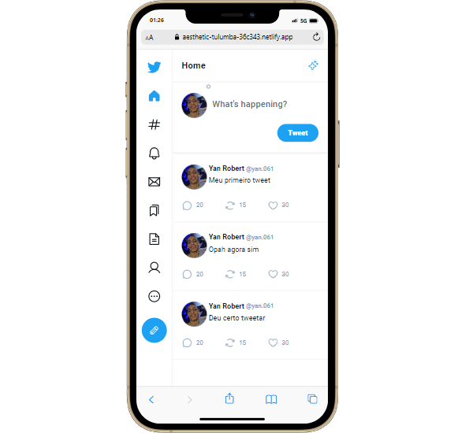

<h1 align="center">
    
    <p>App Twitter🗣️📱</p>


</h1>

<h1 align="center">
    <a href="https://twitter-app-clone-yan.netlify.app/">
    
    </a>
</h1>

## 📕 Sobre

**App Twitter** É um projeto que foi implementado técnicas de rotas, componentização, layouts... aprendidas em estudos tendo melhorias de otimizanção do carregamento de paginas.

## 🔨 Ferramentas Usadas

- [Node](https://nodejs.org/en)
- [React](https://react.dev/)
- [Vite](https://vitejs.dev/)
- [TypeScript](https://www.typescriptlang.org/)
- [Figma](https://www.figma.com/community/file/1202694130789327431/twitter-ui)

## ♻️ Como Contribuir

```bash
  # Clonar o Projeto
  $ git clone https://github.com/yanrobert10/twitter-ui-react.git

```

```bash
  # Entar no Diretorio
  $ cd twitter-ui-react

```

```bash
  # Instalar dependências. if use npm
  $ npm install

```

<p>OU</p>

```bash
  # Instalar dependências. if use yarn
  $ yarn install
```

## Licença
 Este projeto está sob licença MIT. Veja o arquivo
[LICENSE](./LICENSE) para mais detalhes.